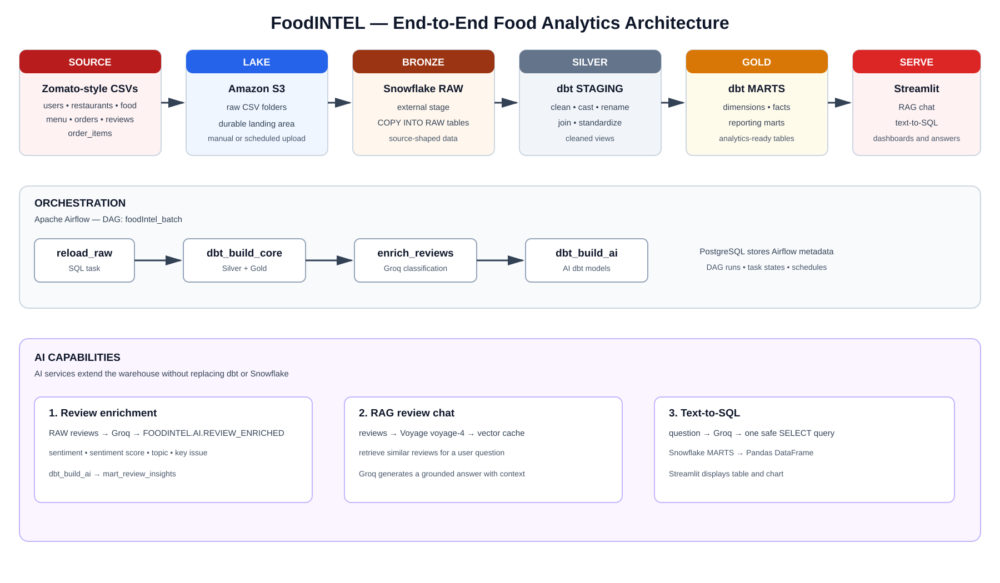

# FoodINTEL

FoodINTEL is an end-to-end food analytics platform. It loads Zomato-style data
into Snowflake, transforms it with dbt, orchestrates the pipeline with Airflow,
enriches reviews with Groq, creates Voyage embeddings for RAG, and serves
results through Streamlit.

The architecture is:

```text
CSV files → Amazon S3 → Snowflake RAW → dbt STAGING/Silver → dbt MARTS/Gold → Streamlit
                                      └──────── Airflow orchestrates the complete flow ────────┘

Reviews → Groq enrichment → FOODINTEL.AI.REVIEW_ENRICHED
Reviews → Voyage voyage-4 embeddings → RAG chat
MARTS → Groq text-to-SQL → read-only Snowflake queries



See [`architecture/`](architecture/) for the detailed file map, flow guide,
diagram source, and interview preparation.
```

## Current repository

- `snowflake/01_setup.sql` — database, schemas, warehouse, and `DBT_ROLE`
- `snowflake/02_storage_integraion.sql` — S3 storage integration
- `snowflake/03_stage_and_formats.sql` — CSV format and external stage
- `snowflake/04_raw_tables.sql` — RAW table definitions
- `snowflake/05_load_data.sql` — `COPY INTO` statements and row-count checks
- `aws/iam/s3-read-policy.json` — read-only S3 policy for the integration role
- `data/` — local datasets; intentionally excluded from Git

The repository includes the Snowflake foundation, dbt Silver and Gold models,
Airflow orchestration, Groq review enrichment, Voyage embeddings, RAG, and
Streamlit text-to-SQL serving applications.

## Data model

The source data covers:

- restaurants and menus
- food items
- users
- orders and order items
- customer reviews

The Snowflake setup follows a medallion-style layout. RAW/BRONZE contains
landed source data, the dbt `STAGING` schema is the Silver layer, and the dbt
`MARTS` schema is the Gold layer. Snapshots and AI-enrichment schemas can be
added as the project grows.

## Prerequisites

- An AWS account with an S3 bucket
- A Snowflake account with permission to create the database, warehouse,
  storage integration, stages, tables, and roles
- SnowSQL, Snowsight, or another Snowflake SQL client
- Local source files placed under `data/` (not committed)

## dbt project

The dbt project is located in `foodIntel/` and uses the Snowflake adapter.

```text
foodIntel/
├── dbt_project.yml
├── macros/
├── models/
│   ├── staging/       # Silver: cleaned views sourced from RAW
│   └── marts/         # Gold: dimensions, facts, and reporting tables
├── seeds/
├── snapshots/
└── tests/
```

The Silver staging models read from the `FOODINTEL.RAW` tables declared in
`foodIntel/models/staging/_sources.yml`. The Gold marts build dimensions,
incremental fact tables, and reporting models from the Silver layer. Model
materializations are configured in `foodIntel/dbt_project.yml`.

### dbt prerequisites

- Python and dbt Core
- `dbt-snowflake`
- A Snowflake user with access to the `FOODINTEL` database and required
  schemas/warehouse
- A Snowflake authentication method supported by your organization

Install the adapter in the active Python environment:

```bash
python -m pip install dbt-snowflake
```

Configure the profile outside the repository at `~/.dbt/profiles.yml`.
For local development, key-pair authentication is recommended. Keep the
private key and passphrase outside Git; never put credentials in this README,
SQL files, or committed YAML files.

Run dbt from the project directory:

```bash
cd foodIntel
dbt debug
dbt run
dbt test
```

Useful development commands:

```bash
dbt parse                 # validate project structure without connecting
dbt compile               # render SQL into target/ without building models
dbt build                 # run models and associated tests
dbt docs generate
```

## Setup

1. Create an S3 bucket and upload the source files using this layout:

   ```text
   s3://<your-bucket>/raw/restaurants/
   s3://<your-bucket>/raw/users/
   s3://<your-bucket>/raw/food/
   s3://<your-bucket>/raw/menu/
   s3://<your-bucket>/raw/orders/
   s3://<your-bucket>/raw/order_items/
   s3://<your-bucket>/raw/reviews/
   ```

2. Configure the AWS IAM role and trust relationship required by the
   Snowflake storage integration. Review `aws/iam/s3-read-policy.json` and
   replace its environment-specific bucket with your own value.

3. Replace the example/environment-specific AWS values in
   `snowflake/02_storage_integraion.sql` and
   `snowflake/03_stage_and_formats.sql`. Do not put credentials or external
   IDs in SQL files committed to Git.

4. Run the Snowflake scripts in order:

   ```text
   snowflake/01_setup.sql
   snowflake/02_storage_integraion.sql
   snowflake/03_stage_and_formats.sql
   snowflake/04_raw_tables.sql
   snowflake/05_load_data.sql
   ```

5. Verify the row counts returned by the final script. This validates the
   RAW/BRONZE layer before building Silver and Gold models.

6. Configure `~/.dbt/profiles.yml`, then run `dbt debug`, `dbt run`, and
   `dbt test` from the `foodIntel/` directory.

## Security and privacy

This repository intentionally does **not** include raw CSV data or credentials.
The source files contain personal and sensitive-looking fields such as names,
emails, passwords, addresses, user identifiers, order details, and review
text. Keep them in protected storage and use anonymized or synthetic fixtures
for examples and tests.

Before publishing, rotate any AWS/Snowflake credential or external ID that has
ever been committed, shared, or exposed. Also review account IDs, bucket names,
role ARNs, URLs, and IAM policies for unwanted environment disclosure.

To verify what Git would include before the first push:

```bash
git init
git status --short --ignored
git add README.md .gitignore snowflake aws
git diff --cached --stat
git diff --cached --name-only
```

If a sensitive file was staged before it was added to `.gitignore`, remove it
from the index without deleting the local copy:

```bash
git rm --cached credentials
git rm --cached data/*.csv
```

## Roadmap

- Parameterize environment-specific Snowflake and S3 configuration
- Expand dbt tests, documentation, and incremental models
- Add stronger data-quality tests, CI/CD, secret management, and monitoring
- Add environment-specific configuration and a least-privilege service role

## Interview summary

> FoodINTEL is a Snowflake-based medallion data platform orchestrated by Airflow. Source CSV files land in S3, Snowflake loads them into RAW, dbt creates Silver staging views and Gold marts, and AI services enrich reviews, support RAG, and generate read-only SQL for business questions. PostgreSQL stores Airflow metadata, while Snowflake stores the analytical data.

See [`architecture/interview_questions.md`](architecture/interview_questions.md)
for interview questions and answers.
